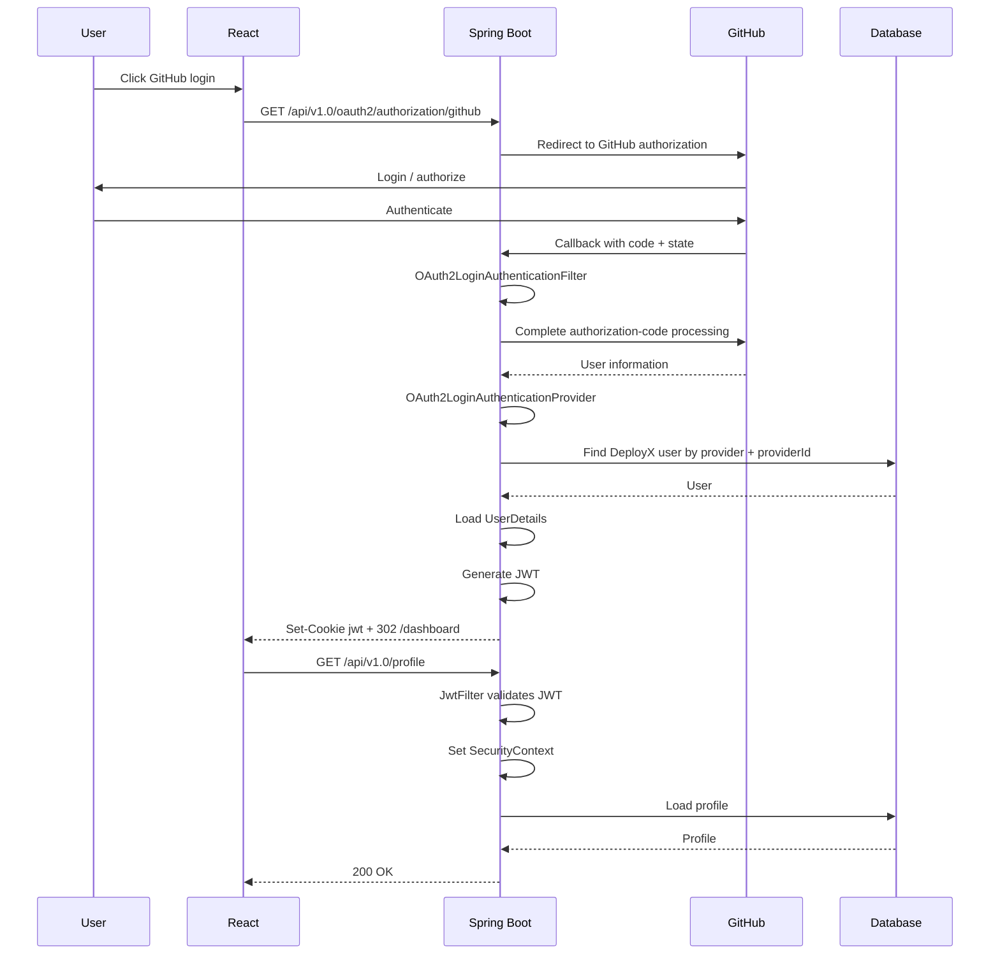

# DeployX OAuth2 Flow

## 1. Purpose

This document explains the GitHub OAuth2 implementation used by DeployX at the protocol, Spring Security, backend, cookie, and frontend levels.

The implementation uses GitHub as the external identity provider and then converts successful OAuth2 authentication into a DeployX JWT-based authentication session.

---

## 2. Complete Flow

```text
User
 │
 ▼
React
 │
 │ GET /api/v1.0/oauth2/authorization/github
 ▼
Spring Security
 │
 │ 302
 ▼
GitHub
 │
 │ User authenticates/authorizes
 ▼
GitHub
 │
 │ authorization code + state
 ▼
Spring Boot callback
 │
 ▼
OAuth2LoginAuthenticationFilter
 │
 ▼
OAuth2LoginAuthenticationProvider
 │
 ▼
OAuth2User / CustomOAuth2UserService
 │
 ▼
DeployX database
 │
 ▼
OAuth2AuthenticationSuccessHandler
 │
 ├── Generate DeployX JWT
 ├── Set HttpOnly jwt cookie
 └── 302 /dashboard
 ▼
React Dashboard
 │
 │ GET /api/v1.0/profile
 ▼
JwtFilter
 │
 ▼
SecurityContext
 │
 ▼
ProfileController
 │
 ▼
Database
 │
 ▼
200 OK
```

---

## 3. OAuth2 vs JWT

These solve different problems.

### OAuth2

OAuth2 is used to delegate authentication to GitHub.

```text
"Can GitHub authenticate this user and provide the requested identity information?"
```

### JWT

JWT is used by DeployX for subsequent application API authentication.

```text
"How does DeployX authenticate requests after login?"
```

Therefore:

```text
GitHub OAuth2
    =
External identity/authentication flow

DeployX JWT
    =
Application API authentication
```

---

## 4. Starting OAuth2 From React

The GitHub button uses:

```js
function handleGithubSignIn() {
  window.location.href =
    'http://localhost:8082/api/v1.0/oauth2/authorization/github'
}
```

The browser navigates to Spring Security.

`fetch()` is intentionally not used for starting this flow because OAuth2 relies on browser redirects between the application and the provider.

---

## 5. Authorization Endpoint

The first backend request is:

```text
GET /api/v1.0/oauth2/authorization/github
```

Spring Security's:

```text
OAuth2AuthorizationRequestRedirectFilter
```

handles the request and redirects the browser to GitHub.

The authorization URL contains parameters similar to:

```text
response_type=code
client_id=...
scope=read:user user:email
state=...
redirect_uri=http://localhost:8082/api/v1.0/login/oauth2/code/github
code_challenge=...
code_challenge_method=S256
```

---

## 6. Authorization Code Flow

The high-level protocol is:

```text
1. Application starts OAuth
2. Browser goes to GitHub
3. User authenticates with GitHub
4. GitHub asks for/records authorization
5. GitHub redirects browser back
6. Application receives authorization code
7. Spring Security completes OAuth2 processing
8. Application receives authenticated user information
```

The authorization code is temporary.

It is not the DeployX JWT.

---

## 7. `state`

Spring Security creates a `state` value for the authorization request.

Conceptually:

```text
Application
    │
    │ create state
    ▼
Authorization request
    │
    ▼
GitHub
    │
    │ return state
    ▼
Callback
    │
    ▼
Validate correlation with original request
```

The state parameter helps protect the OAuth flow from forged or unrelated callback requests.

The application should allow Spring Security to manage this OAuth2 state rather than manually implementing its own state handling.

---

## 8. PKCE

The authorization request generated by the running application includes:

```text
code_challenge
code_challenge_method=S256
```

This is part of PKCE support.

Conceptually:

```text
Client creates verifier
        │
        ▼
Create challenge from verifier
        │
        ▼
Send challenge with authorization request
        │
        ▼
Receive authorization code
        │
        ▼
Use verifier during code exchange
```

PKCE binds the authorization-code exchange to the party that initiated the authorization request.

Spring Security manages the OAuth2 authorization request details.

---

## 9. GitHub Authentication

After the browser reaches GitHub, the user authenticates with GitHub.

DeployX does not receive the user's GitHub password.

After authorization, GitHub redirects to:

```text
http://localhost:8082/api/v1.0/login/oauth2/code/github
```

with temporary OAuth parameters such as:

```text
code=...
state=...
```

These temporary values should not be stored in documentation or committed to logs.

---

## 10. Callback Processing

Spring Security receives the callback.

The important filter is:

```text
OAuth2LoginAuthenticationFilter
```

It then uses the OAuth2 authentication provider:

```text
OAuth2LoginAuthenticationProvider
```

The conceptual transition is:

```text
Authorization code
        │
        ▼
Spring Security OAuth2 processing
        │
        ▼
Authenticated OAuth2User
```

The running application's logs showed this sequence:

```text
Invoking OAuth2LoginAuthenticationFilter
Authenticating request with OAuth2LoginAuthenticationProvider
```

---

## 11. OAuth2User

After successful processing, Spring Security exposes the authenticated principal as an `OAuth2User`.

The success handler accesses:

```java
OAuth2User oauth2User =
        (OAuth2User) authentication.getPrincipal();
```

The application extracts the GitHub ID:

```java
Object id = oauth2User.getAttribute("id");
String providerId = String.valueOf(id);
```

This creates the external identity key:

```text
provider   = GITHUB
providerId = <GitHub ID>
```

---

## 12. CustomOAuth2UserService

`CustomOAuth2UserService` is the bridge between GitHub's user representation and DeployX's internal user representation.

Conceptually:

```text
GitHub
  │
  ▼
OAuth2User
  │
  ▼
CustomOAuth2UserService
  │
  ├── inspect provider data
  ├── identify external account
  └── synchronize/find DeployX user
  │
  ▼
DeployX User
```

The external provider ID is important because it provides a stable identity for the provider account.

---

## 13. Database Identity

The implementation uses:

```text
provider
providerId
```

to locate the external account.

The lookup in the success handler is:

```java
userRepository
    .findByProviderAndProviderId("GITHUB", providerId)
```

This avoids using a display name as the primary external identity.

---

## 14. OAuth2AuthenticationSuccessHandler

The success handler runs after OAuth2 authentication succeeds.

Its responsibilities are:

```text
OAuth2 authentication success
        │
        ▼
Get OAuth2User
        │
        ▼
Extract GitHub ID
        │
        ▼
Find DeployX user
        │
        ▼
Load UserDetails
        │
        ▼
Generate JWT
        │
        ▼
Set jwt cookie
        │
        ▼
Redirect to React
```

The class is:

```text
OAuth2AuthenticationSuccessHandler
```

and implements:

```java
AuthenticationSuccessHandler
```

---

## 15. Finding the DeployX User

The success handler performs:

```java
Object id = oauth2User.getAttribute("id");
String providerId = String.valueOf(id);

User user = userRepository
        .findByProviderAndProviderId("GITHUB", providerId)
        .orElseThrow(() ->
                new RuntimeException("GitHub user not found"));
```

The external GitHub identity is therefore mapped to the internal application user.

---

## 16. Loading UserDetails

The handler then loads the application's normal `UserDetails`:

```java
var userDetails =
        userDetailsService.loadUserByUsername(user.getEmail());
```

This is the bridge that allows the OAuth2 login to reuse the existing JWT generation mechanism.

```text
OAuth2User
    │
    ▼
DeployX User
    │
    ▼
UserDetails
    │
    ▼
JwtUtil
    │
    ▼
JWT
```

---

## 17. JWT Generation

The handler generates the DeployX token:

```java
String jwtToken =
        jwtUtil.generateToken(userDetails);
```

This is deliberately a DeployX token rather than a GitHub authorization code.

The architecture is therefore:

```text
GitHub proves identity
        ↓
DeployX trusts successful OAuth2 authentication
        ↓
DeployX generates its own JWT
        ↓
DeployX APIs use that JWT
```

---

## 18. JWT Cookie Creation

The generated token is placed in:

```text
jwt
```

using:

```java
ResponseCookie cookie = ResponseCookie.from(
        "jwt",
        jwtToken
)
.httpOnly(true)
.path("/")
.maxAge(Duration.ofDays(1))
.sameSite("Strict")
.build();
```

The response then contains:

```java
response.addHeader(
        "Set-Cookie",
        cookie.toString()
);
```

---

## 19. Cookie Security Properties

| Attribute | Current setting | Meaning |
|---|---|---|
| Name | `jwt` | Authentication cookie |
| HttpOnly | `true` | JavaScript cannot normally read the token |
| Path | `/` | Applies to application paths |
| Max-Age | 1 day | Configured lifetime |
| SameSite | `Strict` | Restricts cross-site cookie sending |

`HttpOnly` does not mean the browser cannot send the cookie. It means normal JavaScript cannot directly read it.

The browser automatically includes applicable cookies in requests.

---

## 20. Redirect to Dashboard

The success handler finishes with:

```java
response.sendRedirect(
        "http://localhost:5173/dashboard"
);
```

Therefore the callback response effectively performs:

```text
Set-Cookie: jwt=<DeployX JWT>
Location: http://localhost:5173/dashboard
Status: 302
```

The browser follows the redirect.

---

## 21. Dashboard Request

The browser requests:

```text
GET http://localhost:5173/dashboard
```

The dashboard itself is served by the React development server.

A `200 OK` here means React successfully served the dashboard page.

The important authentication test occurs when the dashboard calls a protected backend API.

---

## 22. Protected `/profile` Request

The frontend can call:

```js
fetch('http://localhost:8082/api/v1.0/profile', {
  method: 'GET',
  credentials: 'include'
})
```

The browser sends the JWT cookie.

The backend processes:

```text
GET /api/v1.0/profile
        │
        ▼
SecurityFilterChain
        │
        ▼
JwtFilter
        │
        ▼
JWT validation
        │
        ▼
UserDetails lookup
        │
        ▼
Authentication
        │
        ▼
SecurityContext
        │
        ▼
ProfileController
        │
        ▼
Database
        │
        ▼
200 OK
```

---

## 23. Why `credentials: 'include'` Matters

The React frontend and Spring Boot backend run on different origins during development:

```text
React:
http://localhost:5173

Spring Boot:
http://localhost:8082
```

The frontend therefore explicitly uses:

```js
credentials: 'include'
```

for cookie-dependent requests.

The backend CORS configuration also permits credentials.

---

## 24. JwtFilter

The JWT filter is responsible for authenticating subsequent API requests.

Conceptually:

```text
Request
  │
  ▼
Read JWT
  │
  ▼
Validate JWT
  │
  ▼
Extract identity
  │
  ▼
Load UserDetails
  │
  ▼
Create Authentication
  │
  ▼
SecurityContextHolder
```

Once the `SecurityContext` contains an authenticated principal, protected controllers can use Spring Security's authentication information.

---

## 25. ProfileController

The profile endpoint obtains the authenticated identity from the security context:

```java
@GetMapping("/profile")
public ProfileResponse getDetails(
        @CurrentSecurityContext(
            expression = "authentication?.name"
        )
        String email
) {
    return profile.getProfile(email);
}
```

This means the frontend does not need to send:

```json
{
  "email": "..."
}
```

to identify the current user.

The backend derives the identity from the authenticated security context.

---

## 26. Complete Sequence Diagram



---

## 27. Actual Verified Flow

The implementation was tested with a real GitHub OAuth login.

The observed sequence included:

```text
GET /oauth2/authorization/github
        ↓
302 → GitHub
        ↓
GET /login/oauth2/code/github
        ↓
OAuth2LoginAuthenticationProvider
        ↓
Authenticated = true
        ↓
JWT cookie created
        ↓
302 → http://localhost:5173/dashboard
        ↓
GET /api/v1.0/profile
        ↓
200 OK
```

The protected profile response confirmed the authenticated application user.

This demonstrates that the implemented flow works from external OAuth authentication through to a JWT-protected DeployX API.

---

## 28. Why the 302 Responses Are Normal

OAuth2 relies on redirects.

### Initial redirect

```text
GET /oauth2/authorization/github
        ↓
302
        ↓
GitHub
```

### Final application redirect

```text
GET /login/oauth2/code/github
        ↓
OAuth authentication success
        ↓
302
        ↓
http://localhost:5173/dashboard
```

Therefore, a `302` in the OAuth Network tab is not automatically an error.

The important question is:

> Where does the browser go after the redirect?

---

## 29. Debugging Checklist

### A. 404 on `/oauth2/authorization/github`

Check the backend context path.

Correct:

```text
http://localhost:8082/api/v1.0/oauth2/authorization/github
```

---

### B. No redirect to GitHub

Check:

- `SecurityConfig`
- OAuth2 client configuration
- provider registration
- GitHub client ID
- redirect URI
- Spring Security logs

---

### C. GitHub works but callback fails

Check:

```text
/login/oauth2/code/github
```

and inspect:

```text
OAuth2LoginAuthenticationFilter
OAuth2LoginAuthenticationProvider
CustomOAuth2UserService
```

---

### D. User authentication succeeds but user lookup fails

Check:

```text
provider = GITHUB
providerId = GitHub account ID
```

and:

```java
findByProviderAndProviderId(...)
```

---

### E. Callback succeeds but dashboard does not load

Check:

```java
response.sendRedirect(
    "http://localhost:5173/dashboard"
);
```

---

### F. Dashboard loads but `/profile` returns 401

Check:

```text
1. jwt cookie exists
2. credentials: 'include'
3. CORS allows credentials
4. JwtFilter runs
5. JWT is valid
6. UserDetails lookup succeeds
7. SecurityContext is authenticated
```

---

## 30. Security Considerations

Never commit:

```text
GitHub client secret
JWT signing secret
database password
user passwords
authorization codes
JWT values
session IDs
```

For production deployment, review:

- HTTPS
- `Secure` cookie
- `SameSite`
- CORS origins
- OAuth redirect URI
- secret storage
- JWT expiration
- JWT rotation/revocation requirements
- CSRF protection for cookie-based authentication
- authentication logging

---

## 31. Interview Explanation

A concise explanation of this implementation is:

> DeployX uses Spring Security OAuth2 Client to authenticate users through GitHub. The React frontend starts the flow by navigating to Spring Security's GitHub authorization endpoint. Spring redirects the browser to GitHub. After the user authenticates, GitHub redirects back to the configured callback with an authorization code and state. Spring Security processes the callback using its OAuth2 login filters and provider, obtains an `OAuth2User`, and maps the GitHub identity to a DeployX user. The custom success handler then loads the application's `UserDetails`, generates a DeployX JWT, stores it in an HttpOnly cookie, and redirects the browser to the React dashboard. Subsequent protected API requests include the cookie. `JwtFilter` validates the JWT, establishes authentication in the `SecurityContext`, and the protected controller can retrieve the authenticated user's identity.

---

## 32. One-Line Mental Model

```text
GitHub proves identity
        ↓
DeployX maps identity to its user
        ↓
DeployX creates JWT
        ↓
JWT goes into HttpOnly cookie
        ↓
Browser sends cookie on API requests
        ↓
JwtFilter authenticates requests
```
